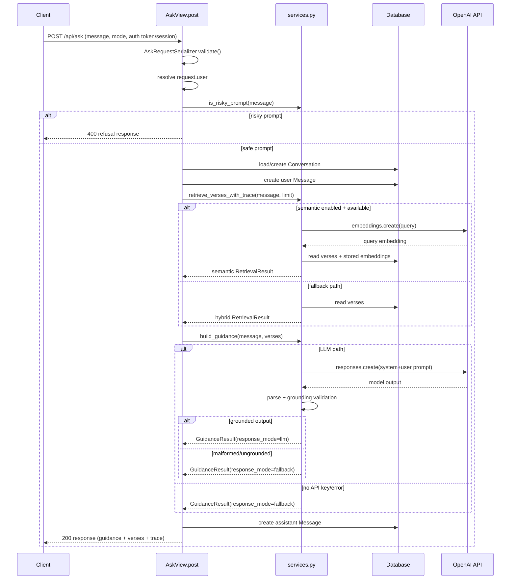
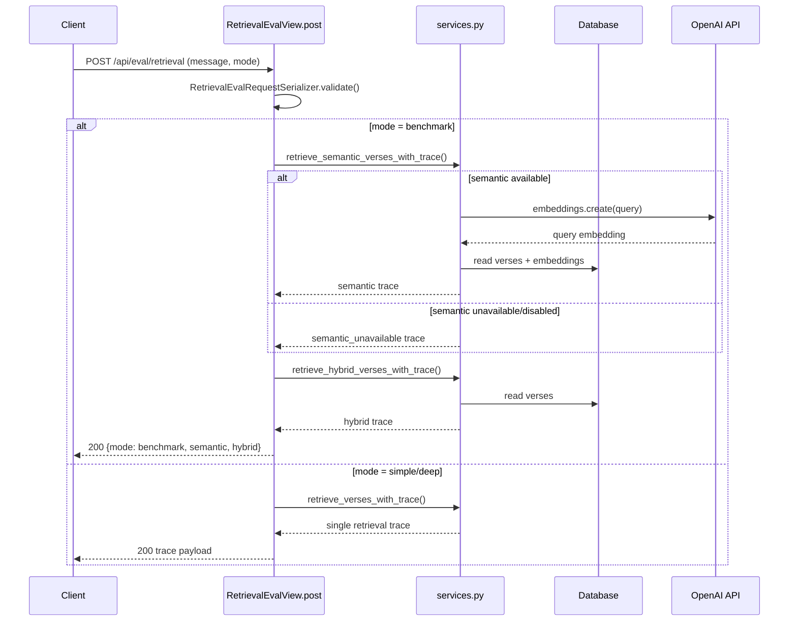
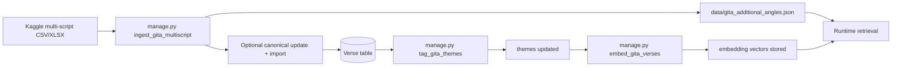

# Developer Guide

## Architecture Overview

The app has one Django project with one primary app: `guide_api`.

API compatibility strategy:
- keep `/api/` as stable path
- expose `/api/v1/` alias with same routes for mobile rollout
- use additive response evolution (avoid breaking field removals/renames)

- `guide_api/models.py`: data models (`Verse`, `Conversation`,
  `Message`, `ResponseFeedback`, `UserSubscription`, `DailyAskUsage`,
  `AskEvent`, `SavedReflection`, `WebAudienceProfile`, `GrowthEvent`)
- `guide_api/services.py`: retrieval, safety checks, and guidance build
- `guide_api/views.py`: API/UI endpoints and orchestration
- `guide_api/permissions.py`: DRF permission classes (e.g.
  `GitaBrowseAPIPermission` on chapter/verse browse routes)
- `guide_api/management/commands/`: import, theme tagging, embeddings
- `guide_api/templates/guide_api/chat_ui.html`: manual test UI

Flow for `POST /api/ask/`:

1. Validate request payload and require authenticated user.
2. Run risk/safety check.
3. Enforce plan quota (`free`/`pro`) for current day.
4. Retrieve verses (`semantic` first, fallback to `hybrid`).
5. Generate grounded guidance (LLM or deterministic fallback).
6. Save user + assistant messages in conversation.
7. Increment daily usage counter and return quota fields
   (+ debug trace fields when `DEBUG=true`).

## ITR Summary Generator (optional)

Bundled **ITR** apps live under **`apps/`** and are activated when **`ITR_ENABLED`**
is true (see **`config/settings_itr.py`** → **`register_itr_settings(globals())`** from
**`config/settings.py`**).

- **URLs:** **`config/urls.py`** mounts **`accounts/`** (django-allauth) and
  **`{ITR_URL_PREFIX}/`** → **`config/urls_itr.py`** when ITR is enabled.
- **Auth:** Same **`AUTH_USER_MODEL`** as Gita; chat-ui uses **`_session_auth_login()`**
  when **`AUTHENTICATION_BACKENDS`** includes allauth + ModelBackend.
  **`ACCOUNT_EMAIL_VERIFICATION`** defaults to **`none`** in **`settings_itr`** so
  signup does not send mail (avoids **500** when SMTP is unset); set **`optional`**
  or **`mandatory`** when outbound email works. **`ItrAccountAdapter`** implements
  **`get_signup_redirect_url`** so ITR referrers land in the document workspace like
  login.
- **Exports:** **`apps.exports.models.ExportedSummary`** stores **`expires_at`** and
  **`pdf_purged_at`**; **`apps.exports.retention.purge_expired_exports`** removes stale
  PDF blobs; **`python manage.py purge_itr_retention`** for cron.
- **Documents:** **`Document.uploaded_file`** may be cleared after export per
  **`ITR_DELETE_INPUT_AFTER_EXPORT`**.
- **Templates:** Project **`templates/`**, static **`static_itr/`**; retention label
  **``** in **`apps/exports/templatetags/itr_export.py`**.
- **OAuth context:** **`register_itr_settings()`** appends
  **`apps.accounts.context_processors.google_oauth`** and
  **`account_profile`** to **`TEMPLATES[0]['OPTIONS']['context_processors']`**
  and sets **`GOOGLE_OAUTH_CONFIGURED`** from env (client id + secret). Without
  this block, **`google_oauth_configured`** stays false on ITR templates even when
  secrets exist.
- **PDF export:** **`apps.exports.views.export_pdf`** generates PDFs only via
  **`apps.exports.weasy_render`** (WeasyPrint). **`apps.exports.pdf_render`**
  (ReportLab) remains for tests/tooling but is not wired from the export view.
  WeasyPrint imports fail with **`OSError`** when **Pango/cairo/GLib** shared
  libraries are absent—install OS packages (see repo **`Dockerfile`** and WeasyPrint
  docs). Fly deploys must rebuild the image after **`Dockerfile`** dependency changes.

Disable ITR entirely with **`ITR_ENABLED=false`** for a Gita-only process.

## Production Deployment Notes (Fly + Neon)

Current production posture:

- App hosting: Fly.io
- Current app slug: `askbhagavadgita`
- Database: Neon PostgreSQL using `DATABASE_URL` from Fly secrets

Operational notes:

- `flyctl deploy` uses local working tree (Git push not required before deploy).
- Runtime secrets must be set with `flyctl secrets set ...` (never commit).
- In free-cost mode, `fly.toml` should keep:
   - `auto_stop_machines = 'stop'`
   - `min_machines_running = 0`
- Cold-start latency after idle is expected in free-cost mode.

Critical Django production setting behind Fly proxy:

- `SECURE_PROXY_SSL_HEADER = ("HTTP_X_FORWARDED_PROTO", "https")`
- Without it, HTTPS redirect loops can occur (`301` to same URL repeatedly).

Useful production commands:

```bash
flyctl status -a askbhagavadgita
flyctl secrets list -a askbhagavadgita
flyctl deploy -a askbhagavadgita
flyctl ssh console -a askbhagavadgita -C "python manage.py migrate --noinput"
flyctl ssh console -a askbhagavadgita -C "python manage.py growth_report"
flyctl ssh console -a askbhagavadgita -C "python manage.py shell -c \"from guide_api.models import Verse; print(Verse.objects.count())\""
```

## Endpoint Walkthrough Index

Use this map to understand the exact call chain for each endpoint.

### `GET /api/health/`

1. `guide_api/urls.py` -> `HealthView`
2. `guide_api/views.py` -> `HealthView.get()`
3. Returns static service status payload.

### `POST /api/auth/register/`

1. `guide_api/urls.py` -> `RegisterView`
2. `guide_api/views.py` -> `RegisterView.post()`
3. Validates username/password payload
4. Creates user and issues DRF token.

### `POST /api/auth/login/`

1. `guide_api/urls.py` -> `LoginView`
2. `guide_api/views.py` -> `LoginView.post()`
3. Authenticates username/password
4. Returns existing/new DRF token.

### `POST /api/auth/logout/` and `GET /api/auth/me/`

1. Both require authenticated user
2. `logout` deletes current token
3. `me` returns current username + plan/quota snapshot.

### `POST /api/auth/plan/`

1. Requires authenticated user
2. Validates `{ "plan": "free|pro" }`
3. Updates `UserSubscription.plan`
4. Returns refreshed quota snapshot.

### `POST /api/ask/`

1. `guide_api/urls.py` -> `AskView`
2. `guide_api/views.py` -> `AskView.post()`
3. Input validation with `AskRequestSerializer`
   - supports `language=en|hi` (defaults to `en`)
4. Resolve identity from `request.user` (not request body)
5. Safety check via `is_risky_prompt()`
6. Quota check via `UserSubscription` + `DailyAskUsage`
7. Orchestration via `_run_guidance_flow()`:
   - `Conversation` load/create for current authenticated user
   - store user `Message`
   - retrieve verses with `retrieve_verses_with_trace()`
   - build response with `build_guidance()` using the latest user message as
     the primary task and recent thread history as supporting context
   - guidance generation honors requested output language (`en`/`hi`)
   - store assistant `Message`
8. Increment daily usage counter
9. Serialize verses with `VerseSerializer`
10. Return API payload (plus debug retrieval fields when `DEBUG=true`).

### Temporary global quota switch

- normal runtime should keep `DISABLE_ALL_QUOTAS=false`
- setting `DISABLE_ALL_QUOTAS=true` disables all guest and signed-in ask caps
  without changing plan records or payment logic
- When enabled:
  - guest ask limits are treated as unlimited
  - signed-in daily/monthly/deep caps return `None`
  - quota UI should render as unlimited rather than blocked
- Quota-specific tests must explicitly run with
  `DISABLE_ALL_QUOTAS=False` when they are validating enforcement behavior.
- quota settings are read through a short-lived cache so transient production
  DB latency does not take down guest chat or quota rendering paths

### `POST /api/eval/retrieval/`

1. `guide_api/urls.py` -> `RetrievalEvalView`
2. `guide_api/views.py` -> `RetrievalEvalView.post()`
3. Permission: `IsAuthenticated` (not publicly callable)
3. Input validation with `RetrievalEvalRequestSerializer`
4. Retrieval paths:
   - `mode=simple|deep` -> `retrieve_verses_with_trace()`
   - `mode=benchmark` -> both:
     - `retrieve_semantic_verses_with_trace()`
     - `retrieve_hybrid_verses_with_trace()`
   - guidance path adds a deterministic confidence gate and can return
     `retrieval_mode=curated_fallback` when initial retrieval is weak
5. Response formatting via `_serialize_trace()`
6. Returns retrieval trace only (no LLM generation).

### `GET /api/daily-verse/`

1. `guide_api/urls.py` -> `DailyVerseView`
2. `guide_api/views.py` -> `DailyVerseView.get()`
3. Reads first verse from DB, or seeds/fetches via `retrieve_verses()`
4. Returns one verse + short reflection.

### `GET /api/chapters/`, `GET /api/chapters/<n>/`, `GET /api/verses/<ch>.<v>/`

1. `guide_api/urls.py` -> `ChapterListView`, `ChapterDetailView`, `VerseDetailView`
2. `guide_api/views.py` -> corresponding `get()` handlers; data from
   `get_all_chapters()`, `get_chapter_detail()`, `get_chapter_verses()`,
   `get_verse_detail()` in `services.py`
3. Permission: `GitaBrowseAPIPermission` (`guide_api/permissions.py`):
   - if `request.auth` is **unset** (no token), allow — supports browser reader
     and same-origin `fetch` without `Authorization`
   - if `request.auth` is set (**Token** authentication), require
     `UserSubscription.plan` in `{plus, pro}`; **free** returns `403`

### `GET /api/history/<user_id>/`

1. `guide_api/urls.py` -> `ConversationHistoryView`
2. `guide_api/views.py` -> `ConversationHistoryView.get()`
3. Allows only owner access (`user_id` must match current user, or `me`)
4. Fetches latest `Conversation` for authenticated user
5. Serializes messages with `MessageSerializer`
6. Returns message timeline payload.

### `GET/POST /api/feedback/`

1. `guide_api/urls.py` -> `FeedbackView`
2. `guide_api/views.py` -> `FeedbackView.get()/post()`
3. `GET`: returns latest feedback rows for authenticated user
4. `POST`: validates fields, resolves conversation (optional), saves
   `ResponseFeedback`.

### `GET/POST /api/chat-ui/`

1. `guide_api/urls.py` -> `ChatUIView`
2. `guide_api/views.py` -> `ChatUIView.get()/post()`
3. `POST`:
   - `action=ask`
     - logged-in: same core flow as API ask via `_run_guidance_flow()`
     - logged-out: uses session-only guest transcript via
       `_run_guest_guidance_flow()` and does not persist `Conversation` rows
    - `action=plan` -> update plan (`free`/`pro`) for signed-in user only
       (debug/local testing path; not intended for production entitlement)
   - `action=feedback` -> `_handle_feedback()`
    - `action=support` -> `_handle_support_request()`
4. Session-assisted UX supports:
   - a sidebar `Today` card for daily-companion framing
   - starter prompts for first-time onboarding
   - primary in-chat composer in the conversation column
   - ask submits progressively update the transcript without a full reload
   - temporary thinking bubble shown while the server response is loading
   - latest structured assistant reply rendered inside the transcript bubble
   - follow-up prompt chips after answers
   - progressive typing animation for the newest assistant reply in chat-ui
   - recent question shortcuts (max 3)
   - guest chat that is temporary and not tagged to any user
   - separate saved conversation threads with sidebar navigation for the
     signed-in user only
   - one sidebar mode selector shared across all conversation threads
   - one sidebar language selector (`en`/`hi`) shared across all threads
   - per-thread sidebar metadata (title, message count, updated time)
   - thread deletion from the sidebar
   - explicit `?new=1` reset for a fresh visible thread
   - continued asks on a selected thread via `conversation_id`
   - progressive enhancement motion stack in template:
     `Animate.css`, `AOS`, `GSAP`, `VanillaTilt` (chat works if unavailable)
5. Renders server-side template for manual testing.

### `POST /api/support/`

1. `guide_api/urls.py` -> `SupportRequestView`
2. `guide_api/views.py` -> `SupportRequestView.post()`
3. Validates payload using `SupportRequestSerializer`:
   - `name`
   - `email`
   - `issue_type` (`payment|account|bug|other`)
   - `message`
4. Creates `SupportTicket` row linked to auth user when available,
   otherwise stores as guest requester.
5. Returns `201` with ticket receipt status.

### Payment billing ledger flow

The Razorpay checkout path now keeps one export-friendly billing row per order:

1. `POST /api/payments/create-order/`
   - resolves the active chat-ui user
   - if `chat_ui_auth_username` exists in session, that identity wins over any
     stale Django-authenticated browser user
   - normalizes plan + currency
   - captures billing fields from request payload
   - creates Razorpay order
   - upserts a single `BillingRecord` row keyed by `razorpay_order_id`
2. `POST /api/payments/verify/`
   - resolves the same active chat-ui user identity
   - verifies signature
   - activates subscription
   - updates the same `BillingRecord` row to `verified`
3. `POST /api/payments/webhook/`
   - `payment.captured` updates the same row to `captured`
   - `payment.failed` updates the same row to `failed`

`BillingRecord` is intended to be the single table exported to Tally or other
invoice workflows, so avoid splitting invoice fields across multiple models.

Related payment inspection endpoints:

- `GET /api/subscription/status/`
  - now returns `latest_billing_record` alongside plan/pricing
- `GET /api/payments/history/?limit=&offset=`
  - returns paginated `BillingRecord` rows for the authenticated user
  - useful for account screens, support, and payment-history UI

Deployment note:

- Fly installs dependencies from `requirements.txt`, so any payment SDK/runtime
  package must be present there even if it already exists in
  `requirements.lock.txt`.

### `POST /api/analytics/events/`

1. `guide_api/urls.py` -> `AnalyticsEventIngestView`
2. `guide_api/views.py` -> `AnalyticsEventIngestView.post()`
3. Permission: `AllowAny` (no auth required — trackable from landing page)
4. Validates payload with `AnalyticsEventIngestSerializer`:
   - `event_type` (choices: `landing_view`, `starter_click`, `share_click`,
     `copy_link_click`, `ask_submit`)
   - `source` (choices: `chat_ui`, `seo_index`, `seo_topic`, `direct`)
   - `path` (URL path string)
   - `metadata` (optional JSON dict, e.g. `{"seed_question": "..."}`)
5. Calls `_log_growth_event()` to persist a `GrowthEvent` row
6. Attaches durable `web_audience_id` cookie to response for guest attribution
7. Returns `{"status": "ok"}` with HTTP 201

### `GET /api/analytics/summary/`

1. `guide_api/urls.py` -> `AnalyticsSummaryView`
2. `guide_api/views.py` -> `AnalyticsSummaryView.get()`
3. Permission: `IsAuthenticated` + staff check (returns 403 for non-staff)
4. Validates query param `?days=N` (1–90, default 7) with
   `AnalyticsSummaryRequestSerializer`
5. Returns JSON payload:
   - `window_days`
   - `all_time`: `unique_visitors`, `unique_users_used`, `queries_fired`,
     `queries_served`
   - `conversion`: `landing_views`, `starter_clicks`, `ask_submits`,
     `share_clicks`, and `*_rate_pct` fields for each
   - `top_sources`: list of `{source, count}` for top 10 UTM sources
   - `daily`: list of `{date, landing_views, ask_submits}` for the window

### `GET/POST /api/saved-reflections/` and `DELETE /api/saved-reflections/<id>/`

1. All routes require authenticated user
2. `POST` validates and saves reflection payload with optional conversation link
3. `GET` returns current user's saved reflections only
4. `DELETE` removes one reflection only when owned by current user
5. Contract is intentionally API-first for Android/iOS reuse.
6. `GET` supports `limit` and `offset` pagination.

### `POST /api/follow-ups/`

1. Requires authenticated user
2. Accepts `message`, `mode`, and `language` (`en`/`hi`)
3. Runs retrieval context detection to infer themes
4. Returns deterministic follow-up prompt objects:
   - `label`
   - `prompt`
   - `intent`
5. Also logged as follow-up `shown` analytics events.

### `GET/PATCH /api/engagement/me/`

1. Requires authenticated user
2. `GET` returns streak and reminder preference snapshot
3. `PATCH` updates reminder preference fields:
   - `reminder_enabled`
   - `reminder_time`
   - `timezone`
   - `preferred_channel`
4. `PATCH` emits `reminder_pref_updated` engagement event on changes
5. `/api/ask/` updates streak on successful response (`streak_updated` event).

## Error Envelope Contract

Error responses now include:
- `error.code`
- `error.message`
- `detail` (kept for backwards compatibility)

## Admin Analytics Dashboard

Use Django Admin -> `Ask events` for a lightweight metrics snapshot:
- asks today
- asks in last 7 days
- fallback rate in last 7 days
- helpful feedback rate in last 7 days
- quota blocks in last 7 days
- unique visitors (all-time and 7d)
- unique users who sent an ask (all-time and 7d)
- total queries fired and served (all-time)
- 7-day conversion funnel: landing views → starter clicks → ask submits → share clicks (with rate %)
- top UTM sources driving visits

The `growth_report` CLI command (`python manage.py growth_report`) prints the same
growth funnel data for 7d and 30d windows in a terminal-friendly format.

## Service Layer Walkthrough

Key functions in `guide_api/services.py`:

1. Safety:
   - `is_risky_prompt()`
2. Retrieval:
   - `retrieve_verses_with_trace()` (semantic preferred, hybrid fallback)
   - `retrieve_semantic_verses_with_trace()`
   - `retrieve_hybrid_verses_with_trace()`
   - `retrieve_verses()` (compat wrapper returning only verses)
3. Guidance:
   - `build_guidance()` (LLM path + output validation)
     - answers the latest user message as the primary query
     - uses recent conversation history only as supporting context
   - `_build_fallback_guidance()` (deterministic fallback)
4. Chat UI thread helpers:
   - `_chat_ui_authenticated_username()` is the source of truth for account
     ownership in chat-ui
   - `_guest_conversation_*()` stores a temporary transcript in session only
   - `_chat_ui_conversation()` treats blank `conversation_id` as an
     explicit request for a fresh thread
   - `_conversation_list()` prepares compact sidebar cards
   - `_handle_delete_conversation()` removes one thread while preserving
     the rest of the chat-ui page state
5. Grounding validation:
   - `_parse_json_payload()`
   - `_is_grounded_response()`
   - `_extract_references()`

## Sequence Diagrams

### `POST /api/ask/`



### `POST /api/eval/retrieval/`



### Offline Data Pipeline



Data pipeline commands (typical order):

1. `python manage.py ingest_gita_multiscript --input /path/bhagavad-gita.xlsx`
2. `python manage.py import_gita --file data/gita_700.json` (optional legacy step)
3. `python manage.py tag_gita_themes`
4. `python manage.py embed_gita_verses`

## Local Setup

```bash
/opt/homebrew/bin/python3 -m venv .venv
source .venv/bin/activate
pip install -r requirements.lock.txt
python manage.py migrate
python manage.py runserver
```

## Useful Commands

 ```bash
 make test
 make ingest-gita-multiscript INPUT=/path/bhagavad-gita.xlsx
 make import-gita FILE=data/gita_700.json
 make tag-gita-themes
 make embed-gita-verses
 make setup-pgvector-index
 make sync-pgvector-embeddings
 make eval-retrieval
 ```

## Data Preparation Pipeline

1. Ingest Kaggle multi-script CSV/XLSX:
   - `python manage.py ingest_gita_multiscript --input /path/bhagavad-gita.xlsx`
   - merges into `data/gita_additional_angles.json` without replacing canonical files
2. Import verses (legacy/manual path):
   - `python manage.py import_gita --file data/gita_700.json`
3. Tag themes:
   - `python manage.py tag_gita_themes`
4. Create embeddings:
   - `python manage.py embed_gita_verses`
5. Optional pgvector index sync (PostgreSQL):
   - `python manage.py setup_pgvector_index`
   - `python manage.py sync_pgvector_embeddings`

## Retrieval Debugging

Use `POST /api/eval/retrieval/` to inspect ranking quality.

- `mode=simple|deep`: single strategy (semantic-preferred pipeline)
- `mode=benchmark`: side-by-side:
  - `semantic`
  - `hybrid`

This endpoint performs retrieval only (no guidance generation).

Offline retrieval evaluation command:

```bash
python manage.py eval_retrieval --file data/retrieval_eval_cases.json --mode pipeline
python manage.py eval_retrieval --file data/retrieval_eval_cases_user_mix.json --mode pipeline
python manage.py eval_retrieval --file data/retrieval_eval_cases.json --mode hybrid
python manage.py eval_retrieval --file data/retrieval_eval_cases.json --mode semantic
python manage.py eval_retrieval --file data/retrieval_eval_cases.json --mode pipeline --strict
python manage.py eval_retrieval --file data/retrieval_eval_cases.json --mode hybrid --report-misses
python manage.py eval_retrieval --file data/retrieval_eval_cases_user_mix.json --mode pipeline --report-misses
```

Eval dataset format (`data/retrieval_eval_cases.json`):

```json
[
  {
    "prompt": "I feel anxious about my career.",
    "expected_references": ["2.47", "3.19"]
  }
]
```

Current starter dataset includes 50 prompts across core topics:
- anxiety/career stress
- anger/frustration
- purpose/direction
- discipline/focus
- comparison/envy

Additional mixed-language eval set is available at:
- `data/retrieval_eval_cases_user_mix.json` (Hindi + Hinglish + English)

Current baseline (hybrid mode, 50-case set):
- hit_rate improved from `0.20` -> `0.54` (v2) -> `0.66` (v3) -> `0.78` (v5)

pgvector phase-1:
- semantic retrieval can use pgvector when PostgreSQL is configured
- rollout is guarded by `ENABLE_PGVECTOR_RETRIEVAL=true`
- default runtime path remains SQLite-safe

## Safety and Grounding Rules

- Risky prompts are blocked before retrieval/generation.
- Guidance must cite only allowed references from retrieved verses.
- If LLM output is malformed or ungrounded, fallback response is used.

## Environment Variables

- `DEBUG`
- `SECRET_KEY`
- `ALLOWED_HOSTS`
- `OPENAI_API_KEY`
- `OPENAI_MODEL`
- `OPENAI_EMBEDDING_MODEL`
- `ENABLE_SEMANTIC_RETRIEVAL`
- `ASK_LIMIT_FREE_DAILY`
- `ASK_LIMIT_PRO_DAILY`

Copy and edit:

```bash
cp .env.example .env
```

## Testing Strategy

- Unit/integration tests live in `guide_api/tests.py`.
- Validate:
  - endpoint behavior
  - safety blocking
  - retrieval traces
  - management command correctness

Run:

```bash
python manage.py test
```
