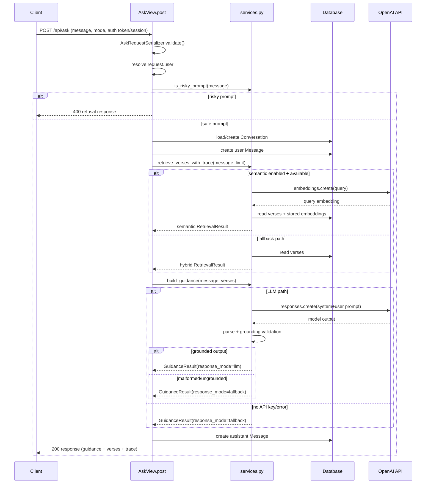
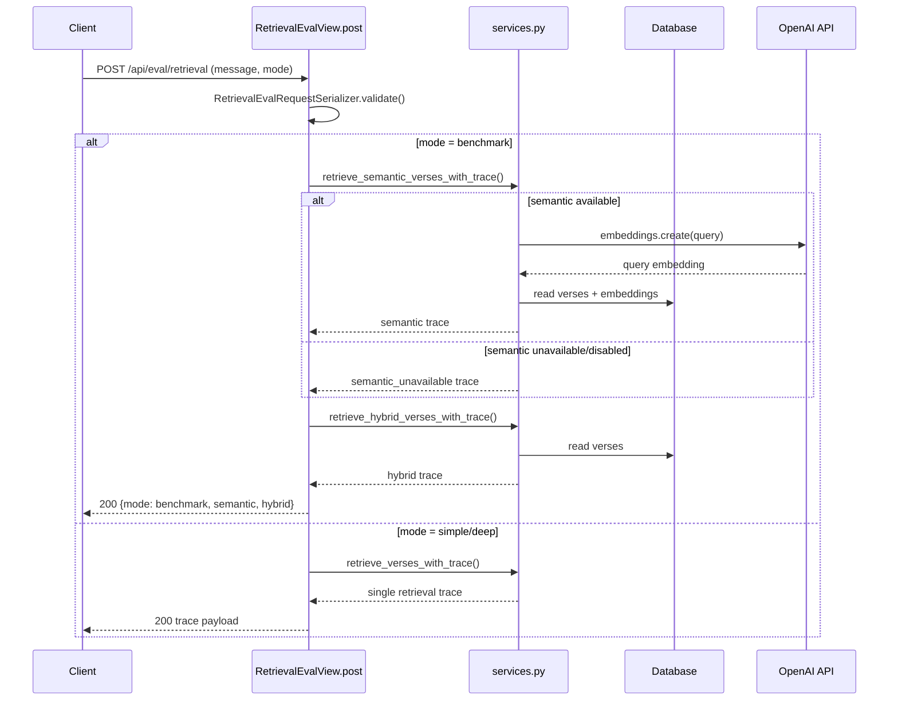

# Developer Guide

## Architecture Overview

The app has one Django project with one primary app: `guide_api`.

API compatibility strategy:
- keep `/api/` as stable path
- expose `/api/v1/` alias with same routes for mobile rollout
- use additive response evolution (avoid breaking field removals/renames)

- `guide_api/models.py`: data models (`Verse`, `Conversation`,
  `Message`, `ResponseFeedback`, `UserSubscription`, `DailyAskUsage`,
  `AskEvent`, `SavedReflection`)
- `guide_api/services.py`: retrieval, safety checks, and guidance build
- `guide_api/views.py`: API/UI endpoints and orchestration
- `guide_api/management/commands/`: import, theme tagging, embeddings
- `guide_api/templates/guide_api/chat_ui.html`: manual test UI

Flow for `POST /api/ask/`:

1. Validate request payload and require authenticated user.
2. Run risk/safety check.
3. Enforce plan quota (`free`/`pro`) for current day.
4. Retrieve verses (`semantic` first, fallback to `hybrid`).
5. Generate grounded guidance (LLM or deterministic fallback).
6. Save user + assistant messages in conversation.
7. Increment daily usage counter and return quota fields
   (+ debug trace fields when `DEBUG=true`).

## Endpoint Walkthrough Index

Use this map to understand the exact call chain for each endpoint.

### `GET /api/health/`

1. `guide_api/urls.py` -> `HealthView`
2. `guide_api/views.py` -> `HealthView.get()`
3. Returns static service status payload.

### `POST /api/auth/register/`

1. `guide_api/urls.py` -> `RegisterView`
2. `guide_api/views.py` -> `RegisterView.post()`
3. Validates username/password payload
4. Creates user and issues DRF token.

### `POST /api/auth/login/`

1. `guide_api/urls.py` -> `LoginView`
2. `guide_api/views.py` -> `LoginView.post()`
3. Authenticates username/password
4. Returns existing/new DRF token.

### `POST /api/auth/logout/` and `GET /api/auth/me/`

1. Both require authenticated user
2. `logout` deletes current token
3. `me` returns current username + plan/quota snapshot.

### `POST /api/auth/plan/`

1. Requires authenticated user
2. Validates `{ "plan": "free|pro" }`
3. Updates `UserSubscription.plan`
4. Returns refreshed quota snapshot.

### `POST /api/ask/`

1. `guide_api/urls.py` -> `AskView`
2. `guide_api/views.py` -> `AskView.post()`
3. Input validation with `AskRequestSerializer`
4. Resolve identity from `request.user` (not request body)
5. Safety check via `is_risky_prompt()`
6. Quota check via `UserSubscription` + `DailyAskUsage`
7. Orchestration via `_run_guidance_flow()`:
   - `Conversation` load/create for current authenticated user
   - store user `Message`
   - retrieve verses with `retrieve_verses_with_trace()`
   - build response with `build_guidance()`
   - store assistant `Message`
8. Increment daily usage counter
9. Serialize verses with `VerseSerializer`
10. Return API payload (plus debug retrieval fields when `DEBUG=true`).

### `POST /api/eval/retrieval/`

1. `guide_api/urls.py` -> `RetrievalEvalView`
2. `guide_api/views.py` -> `RetrievalEvalView.post()`
3. Input validation with `RetrievalEvalRequestSerializer`
4. Retrieval paths:
   - `mode=simple|deep` -> `retrieve_verses_with_trace()`
   - `mode=benchmark` -> both:
     - `retrieve_semantic_verses_with_trace()`
     - `retrieve_hybrid_verses_with_trace()`
5. Response formatting via `_serialize_trace()`
6. Returns retrieval trace only (no LLM generation).

### `GET /api/daily-verse/`

1. `guide_api/urls.py` -> `DailyVerseView`
2. `guide_api/views.py` -> `DailyVerseView.get()`
3. Reads first verse from DB, or seeds/fetches via `retrieve_verses()`
4. Returns one verse + short reflection.

### `GET /api/history/<user_id>/`

1. `guide_api/urls.py` -> `ConversationHistoryView`
2. `guide_api/views.py` -> `ConversationHistoryView.get()`
3. Allows only owner access (`user_id` must match current user, or `me`)
4. Fetches latest `Conversation` for authenticated user
5. Serializes messages with `MessageSerializer`
6. Returns message timeline payload.

### `GET/POST /api/feedback/`

1. `guide_api/urls.py` -> `FeedbackView`
2. `guide_api/views.py` -> `FeedbackView.get()/post()`
3. `GET`: returns latest feedback rows for authenticated user
4. `POST`: validates fields, resolves conversation (optional), saves
   `ResponseFeedback`.

### `GET/POST /api/chat-ui/`

1. `guide_api/urls.py` -> `ChatUIView`
2. `guide_api/views.py` -> `ChatUIView.get()/post()`
3. `POST`:
   - `action=ask` -> same core flow as API ask via `_run_guidance_flow()`
     - for known usernames, applies same quota counters as API
   - `action=plan` -> update plan (`free`/`pro`) for known usernames
   - `action=feedback` -> `_handle_feedback()`
4. Session-assisted UX supports:
   - starter prompts for first-time onboarding
   - follow-up prompt chips after answers
   - recent question shortcuts (max 3)
5. Renders server-side template for manual testing.

### `GET/POST /api/saved-reflections/` and `DELETE /api/saved-reflections/<id>/`

1. All routes require authenticated user
2. `POST` validates and saves reflection payload with optional conversation link
3. `GET` returns current user's saved reflections only
4. `DELETE` removes one reflection only when owned by current user
5. Contract is intentionally API-first for Android/iOS reuse.
6. `GET` supports `limit` and `offset` pagination.

### `POST /api/follow-ups/`

1. Requires authenticated user
2. Accepts `message` and `mode`
3. Runs retrieval context detection to infer themes
4. Returns deterministic follow-up prompt objects:
   - `label`
   - `prompt`
   - `intent`
5. Also logged as follow-up `shown` analytics events.

### `GET/PATCH /api/engagement/me/`

1. Requires authenticated user
2. `GET` returns streak and reminder preference snapshot
3. `PATCH` updates reminder preference fields:
   - `reminder_enabled`
   - `reminder_time`
   - `timezone`
   - `preferred_channel`
4. `PATCH` emits `reminder_pref_updated` engagement event on changes
5. `/api/ask/` updates streak on successful response (`streak_updated` event).

## Error Envelope Contract

Error responses now include:
- `error.code`
- `error.message`
- `detail` (kept for backwards compatibility)

## Admin Analytics Dashboard

Use Django Admin -> `Ask events` for a lightweight metrics snapshot:
- asks today
- asks in last 7 days
- fallback rate in last 7 days
- helpful feedback rate in last 7 days
- quota blocks in last 7 days

Event rows are logged from both `POST /api/ask/` and `chat-ui` asks.

## Service Layer Walkthrough

Key functions in `guide_api/services.py`:

1. Safety:
   - `is_risky_prompt()`
2. Retrieval:
   - `retrieve_verses_with_trace()` (semantic preferred, hybrid fallback)
   - `retrieve_semantic_verses_with_trace()`
   - `retrieve_hybrid_verses_with_trace()`
   - `retrieve_verses()` (compat wrapper returning only verses)
3. Guidance:
   - `build_guidance()` (LLM path + output validation)
   - `_build_fallback_guidance()` (deterministic fallback)
4. Grounding validation:
   - `_parse_json_payload()`
   - `_is_grounded_response()`
   - `_extract_references()`

## Sequence Diagrams

### `POST /api/ask/`



### `POST /api/eval/retrieval/`



### Offline Data Pipeline

```mermaid
flowchart LR
    A[Kaggle CSV: data/Bhagwad_Gita.csv]
    B[scripts/convert_kaggle_gita_csv.py]
    C[JSON: data/gita_700.json]
    D[manage.py import_gita]
    E[(Verse table)]
    F[manage.py tag_gita_themes]
    G[themes updated]
    H[manage.py embed_gita_verses]
    I[embedding vectors stored]
    J[Runtime retrieval]

    A --> B --> C --> D --> E
    E --> F --> G --> H --> I --> J
```



Data pipeline commands (typical order):

1. `python scripts/convert_kaggle_gita_csv.py --input data/Bhagwad_Gita.csv --output data/gita_700.json`
2. `python manage.py import_gita --file data/gita_700.json`
3. `python manage.py tag_gita_themes`
4. `python manage.py embed_gita_verses`

## Local Setup

```bash
/opt/homebrew/bin/python3 -m venv .venv
source .venv/bin/activate
pip install -r requirements.lock.txt
python manage.py migrate
python manage.py runserver
```

## Useful Commands

```bash
make test
make import-gita FILE=data/gita_700.json
make tag-gita-themes
make embed-gita-verses
make eval-retrieval
```

## Data Preparation Pipeline

1. Convert Kaggle CSV:
   - `python scripts/convert_kaggle_gita_csv.py --input data/Bhagwad_Gita.csv --output data/gita_700.json`
2. Import verses:
   - `python manage.py import_gita --file data/gita_700.json`
3. Tag themes:
   - `python manage.py tag_gita_themes`
4. Create embeddings:
   - `python manage.py embed_gita_verses`

## Retrieval Debugging

Use `POST /api/eval/retrieval/` to inspect ranking quality.

- `mode=simple|deep`: single strategy (semantic-preferred pipeline)
- `mode=benchmark`: side-by-side:
  - `semantic`
  - `hybrid`

This endpoint performs retrieval only (no guidance generation).

Offline retrieval evaluation command:

```bash
python manage.py eval_retrieval --file data/retrieval_eval_cases.json --mode pipeline
python manage.py eval_retrieval --file data/retrieval_eval_cases.json --mode hybrid
python manage.py eval_retrieval --file data/retrieval_eval_cases.json --mode semantic
python manage.py eval_retrieval --file data/retrieval_eval_cases.json --mode pipeline --strict
python manage.py eval_retrieval --file data/retrieval_eval_cases.json --mode hybrid --report-misses
```

Eval dataset format (`data/retrieval_eval_cases.json`):

```json
[
  {
    "prompt": "I feel anxious about my career.",
    "expected_references": ["2.47", "3.19"]
  }
]
```

Current starter dataset includes 50 prompts across core topics:
- anxiety/career stress
- anger/frustration
- purpose/direction
- discipline/focus
- comparison/envy

Current baseline (hybrid mode, 50-case set):
- hit_rate improved from `0.20` -> `0.54` (v2) -> `0.66` (v3) -> `0.78` (v5)

## Safety and Grounding Rules

- Risky prompts are blocked before retrieval/generation.
- Guidance must cite only allowed references from retrieved verses.
- If LLM output is malformed or ungrounded, fallback response is used.

## Environment Variables

- `DEBUG`
- `SECRET_KEY`
- `ALLOWED_HOSTS`
- `OPENAI_API_KEY`
- `OPENAI_MODEL`
- `OPENAI_EMBEDDING_MODEL`
- `ENABLE_SEMANTIC_RETRIEVAL`
- `ASK_LIMIT_FREE_DAILY`
- `ASK_LIMIT_PRO_DAILY`

Copy and edit:

```bash
cp .env.example .env
```

## Testing Strategy

- Unit/integration tests live in `guide_api/tests.py`.
- Validate:
  - endpoint behavior
  - safety blocking
  - retrieval traces
  - management command correctness

Run:

```bash
python manage.py test
```
