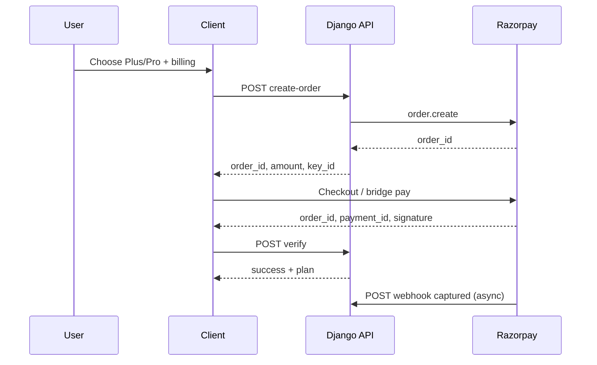
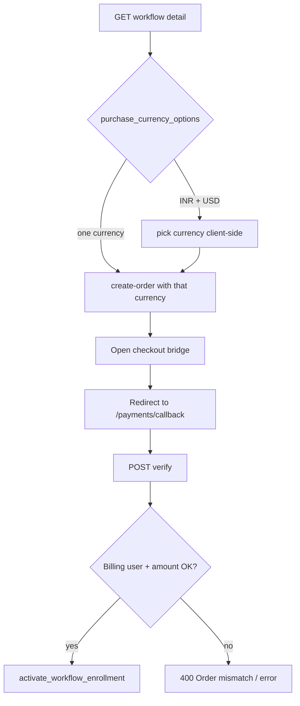

# Payment & checkout — end-to-end workflows

**Purpose:** Document features shipped in the recent payment hardening pass so engineers, support, and mobile authors can follow each path from first user intent through server state and optional webhooks.

**Companion:** High-level API reference → **`PAYMENT_INTEGRATION_ANALYSIS.md`**.  
**Mobile parity checklist:** **`docs/MOBILE_APP_PARITY_BLUEPRINT.md`** (§H subscription, §I sadhana, §J practice workflow).

---

## 0. Shared concepts

### Ledger row (`BillingRecord`)

- One row per **`razorpay_order_id`** (unique).
- Created/updated at **`POST /api/payments/create-order/`** with `payment_status=created`, `amount_minor`, `currency`, `plan` (subscription), metadata (`purchase_kind`, `program_slug` / `workflow_slug` where applicable).
- Moves to **`verified`** on successful **`POST /api/payments/verify/`**, or **`captured`** / **`failed`** from webhooks and client status updates.

### Session “pending” maps (web / same session)

- **`pending_subscription_plans`**: `order_id → plus|pro`
- **`pending_sadhana_orders`**: `order_id → program_slug`
- **`pending_workflow_orders`**: `order_id → workflow_slug`

Mobile clients using **token auth** still get metadata on **`BillingRecord`**, so verify can resolve product even if session keys are missing (metadata + optional session).

### Verify ownership rule (recent hardening)

1. Load **`BillingRecord`** for `razorpay_order_id`.
2. If the row exists and **`user_id`** is set → it **must** equal the current user (else `400 Order ID mismatch`).
3. If the row exists with **`user_id` null** → fall back to **`UserSubscription.razorpay_order_id`** match.
4. If **no** billing row → **`UserSubscription.razorpay_order_id`** must match.

This allows completing verify for an **older** order after a **new** `create-order` advanced **`subscription.razorpay_order_id`**, as long as the ledger row belongs to the user.

---

## 1. Subscription (Plus / Pro) — end to end

### Actors

- User (browser chat-ui **session** or **Bearer token**).
- Django (`CreateOrderView`, `VerifyPaymentView`, `RazorpayWebhookView`).
- Razorpay Checkout (modal web) or native SDK / bridge (mobile).

### Steps (happy path — web chat-ui style)

1. User fills **billing** fields in membership UI (name, email, country, etc.).
2. **`POST /api/payments/create-order/`**  
   Body: `{ "plan": "plus"|"pro", "currency": "INR"|"USD", ...billing }`  
   Server enforces currency vs geo rules, creates Razorpay order, sets **`UserSubscription.razorpay_order_id`**, upserts **`BillingRecord`** (`plan` matches chosen tier, `amount_minor` = catalog price).
3. Client opens Razorpay Checkout with `order_id`, `amount`, `key_id`.
4. User pays; Razorpay **`handler`** returns `razorpay_order_id`, `razorpay_payment_id`, `razorpay_signature`.
5. **`POST /api/payments/verify/`** with those three fields (+ optional `plan` if session pending map missing).  
   Server verifies HMAC, resolves **selected plan** from: session pending map → request `plan` → **`BillingRecord.plan`** (when not a sadhana/workflow purchase) → default **pro**, checks **ledger `amount_minor`** equals **`_payment_amount_for_plan(selected, currency)`**, activates subscription (`plan`, `is_active`, `subscription_end_date`), marks billing **verified**.
6. **`GET /api/subscription/status/`** and **`GET /api/auth/me/`** show paid state.

### Steps (native app — bridge + callback)

1. Same **`create-order`** (token auth).
2. Open **`GET /api/payments/checkout/bridge/?key_id=...&order_id=...&amount=...&currency=...&redirect_uri=<app-link>&...`** (see `PaymentCheckoutBridgeView` for full query params).
3. Bridge runs Checkout.js; on success redirects to **`redirect_uri`** with Razorpay query params (e.g. app route **`/payments/callback`**).
4. App **`POST /api/v1/payments/verify/`** with JSON body from query params.
5. Refresh subscription + home UI.

### Webhook parallel path

- Razorpay sends **`payment.captured`** to **`POST /api/payments/webhook/`** with signed JSON.
- Generic subscription branch: finds **`UserSubscription`** by `order_id`, infers plan from amount/currency if needed, upserts billing **captured**.

### Failure / cancel

- User dismisses checkout → client may **`POST /api/payments/status/`** with failure/cancel so ledger stays accurate.
- **`payment.failed`** webhook → billing row **`failed`**.

---

## 2. Sadhana cycle purchase — end to end

### Steps

1. User chooses a published program (slug from **`GET /api/sadhana/programs/`**).
2. **`POST /api/payments/create-order/`**  
   Body: `{ "product": "sadhana_cycle", "program_slug": "<slug>", "currency": "INR"|"USD", ...billing }`  
   Amount = **`_payment_amount_for_sadhana_cycle(currency)`**. Metadata: `purchase_kind`, `program_slug`. Session: **`pending_sadhana_orders[order_id]=slug`** (when session exists).
3. Pay (web modal or bridge + callback as above).
4. **`POST /api/payments/verify/`**  
   Resolves program from metadata and/or session; **currency** prefers **`BillingRecord.currency`** then subscription default; **rejects** if **`billing_record.amount_minor`** ≠ catalog sadhana amount for that currency; **`activate_sadhana_enrollment`**; billing **verified**.

### Webhook (`payment.captured`)

- Branch when **`metadata.purchase_kind == sadhana_cycle`**.
- **`sad_amount_ok`** requires: published program, webhook **amount** = catalog amount, **`billing_record.currency`** matches payment currency, **`billing_record.amount_minor`** = catalog amount.
- If ok → **`activate_sadhana_enrollment`** + billing **captured** upsert.
- If not ok → **no enrollment**; **`logger.info("razorpay_webhook_skip_sadhana_capture", extra={...})`**.

---

## 3. Practice workflow (paid course) — end to end

### API discovery

1. **`GET /api/practice/workflows/<slug>/`** for a **`purchase_required`** workflow.
2. Response includes **`purchase_currency_options`**: e.g. `["INR"]`, `["USD"]`, or `["INR","USD"]` depending on configured minor prices.

### Mobile currency choice (client-side rule of thumb)

- If API returns only one currency → use it on **`create-order`**.
- If both exist → app may prefer **INR** for India-style locales (implementation in mobile `practice/[slug].tsx`: **`pickWorkflowCheckoutCurrency`** using `purchase_currency_options` + `Intl` locale).

### Steps

1. **`POST /api/payments/create-order/`**  
   Body: `{ "product": "practice_workflow", "workflow_slug": "<slug>", "currency": "INR"|"USD", ...billing }`  
   Amount from **`workflow_purchase_amount_minor(workflow, currency)`**. Metadata + **`pending_workflow_orders`** when session exists.
2. **`GET /api/payments/checkout/bridge/`** with `redirect_uri` = deep link to **`/payments/callback`** (Expo Router).
3. After redirect, app **`POST /api/payments/verify/`** (or **`/api/v1/...`**) with Razorpay fields.
4. Verify path: workflow from metadata/session; **currency** from billing row when set; **expected** minor from **`workflow_purchase_amount_minor`**; rejects if ledger amount ≠ expected; **`activate_workflow_enrollment`**; billing **verified**.
5. **`GET /api/practice/workflows/<slug>/`** and **`GET /api/practice/workflows/me/`** reflect access.

### Webhook (`payment.captured`)

- Branch when **`metadata.purchase_kind == practice_workflow`**.
- **`wf_amount_ok`**: same pattern as sadhana — webhook amount/currency + ledger must match **workflow catalog** price.
- Skip → **`logger.info("razorpay_webhook_skip_practice_workflow_capture", extra={...})`** (no enrollment, no captured upsert).

---

## 4. Verify-only edge cases (reference)

| Scenario | Expected |
|----------|----------|
| Valid signature, billing row **other user** | `400 Order ID mismatch` |
| Valid signature, subscription **`razorpay_order_id`** moved but **billing** matches user + order | **200** (subscription or workflow path) |
| Ledger **`amount_minor`** wrong vs catalog for subscription / sadhana / workflow | `400 Order amount mismatch` |
| Missing `razorpay_*` params | `400` missing params / bad signature |

---

## 5. Webhook vs verify (who wins?)

- **Verify** is the primary path for in-app completion (user session + immediate UX).
- **Webhook** is reliability / server-to-server; for **tagged** sadhana/workflow captures it **must** pass amount/currency/ledger checks or it **will not** double-enroll incorrectly.
- Both should eventually show **`captured`** / **verified** on the same **`BillingRecord`**; ordering can vary.

---

## 6. Files to read when changing behavior

| Area | File |
|------|------|
| Create order, verify, webhook, bridge, status | `guide_api/views.py` |
| Workflow price helpers / enrollment | `guide_api/practice_workflow_views.py` |
| Sadhana amounts / enrollment | `guide_api/sadhana_views.py` |
| Tests | `guide_api/tests.py` (`PaymentIntegrationTests`, `PracticeWorkflowApiTests`) |
| Mobile callback + practice purchase UI | `bhagavadgitaguide_mobile-main/expo/app/payments/callback.tsx`, `expo/app/practice/[slug].tsx` |
| Types | `bhagavadgitaguide_mobile-main/expo/lib/api.ts` (`PracticeWorkflowDetailPayload`) |

---

## 7. Changelog pointer (recent pass)

- Billing-first **verify** ownership; subscription **plan** + **amount** from ledger when applicable.
- **Sadhana** verify amount/currency from billing; **webhook** sadhana + workflow **amount gates**; **`logger.info`** skip events.
- **Practice workflow** **`purchase_currency_options`** on detail API; mobile **currency** + **`payments/callback`** route.
- Docs index: **`README.md`**, **`PAYMENT_INTEGRATION_ANALYSIS.md`**, **`docs/PRODUCTION_RUNBOOK.md`**, parity blueprint §J.

When you extend a flow, update **this file** with a new numbered section or extend the sequence diagrams so the next reader can trace **end to end** without spelunking `views.py`.
