# Mobile user app flows

**Purpose:** Diagrams for the **Expo app** (`bhagavadgitaguide_mobile-main`): auth, tabs, and how each major feature connects to routes and APIs. Mermaid renders in GitHub, many IDEs, and Notion.

**Code reference:** `expo/app/(tabs)/_layout.tsx` — bottom tabs are **Today**, **Ask**, **Meditate**, **History**, **Insights**; `read` and `profile` use `href: null` (reachable via navigation, not tab bar).

**Backend routes:** `/api/…` and `/api/v1/…` are equivalent (`config/urls.py`).

**Product note (Today screen):** Some shortcuts still point to **`/history`** (conversation threads). **Saved reflections library** is also reachable from Today (**`/saved-reflections`**) and from Profile (`expo/app/(tabs)/profile.tsx`).

---

## 1. Entry and authentication

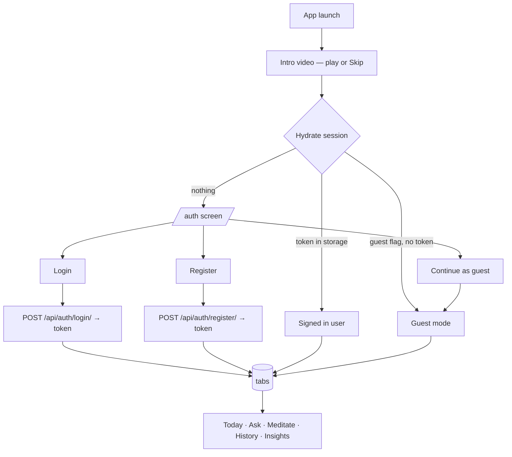

---

## 2. Main shell (tabs + hidden routes)

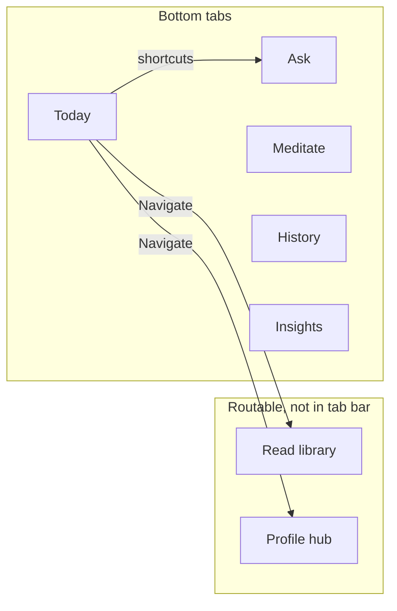

---

## 3. Today tab → downstream features

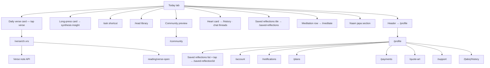

---

## 4. Ask (guidance Q&A)

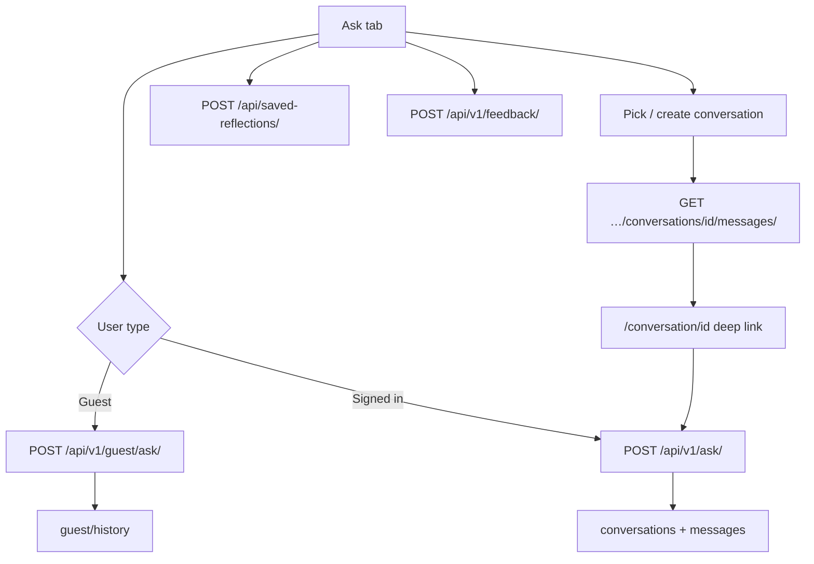

---

## 5. Read (library and search)

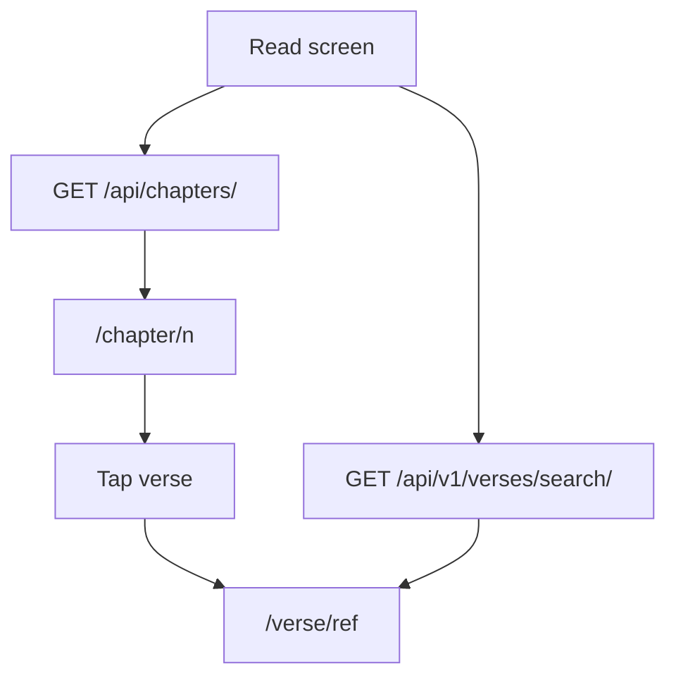

---

## 6. History (threads)

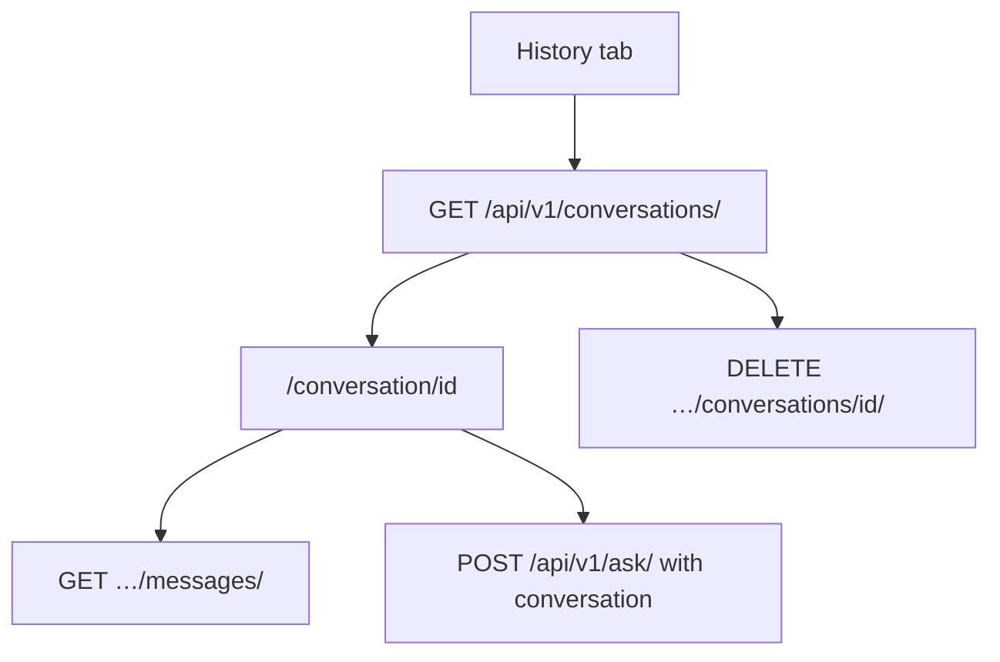

---

## 7. Insights

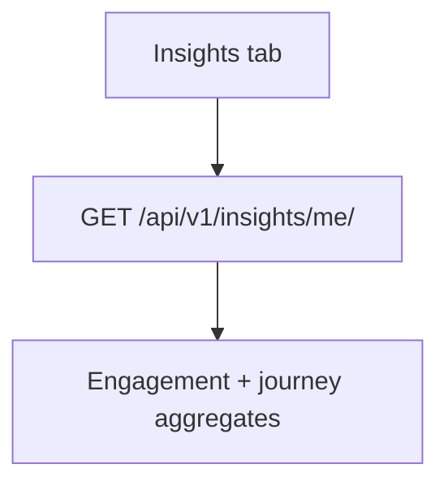

---

## 8. Meditate (workflows and logging)

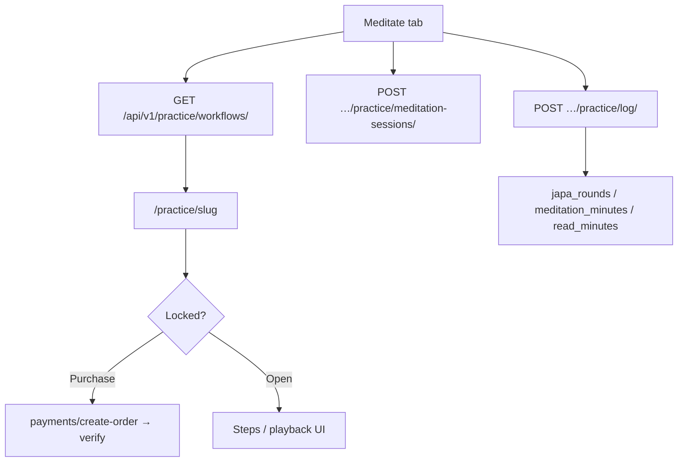

---

## 9. Sadhana (guided programs)

Primary entry in app: **Meditate tab** → “Guided sadhana programs” → **`/sadhana`**.

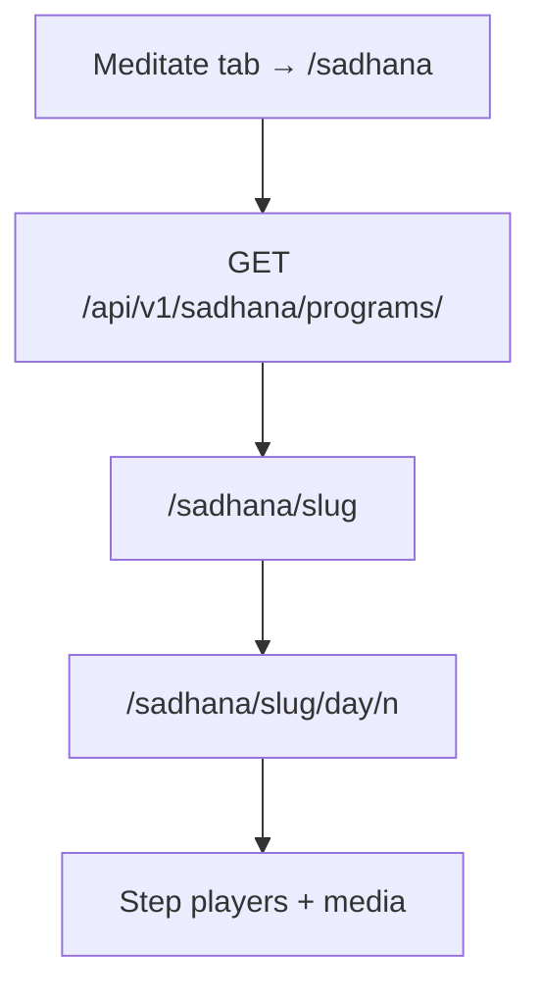

---

## 10. Japa (personal commitments)

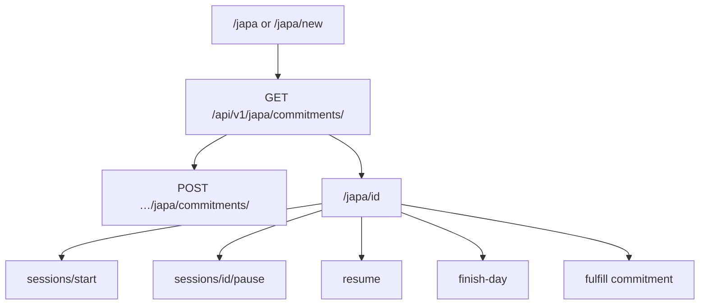

---

## 11. Plans and payments

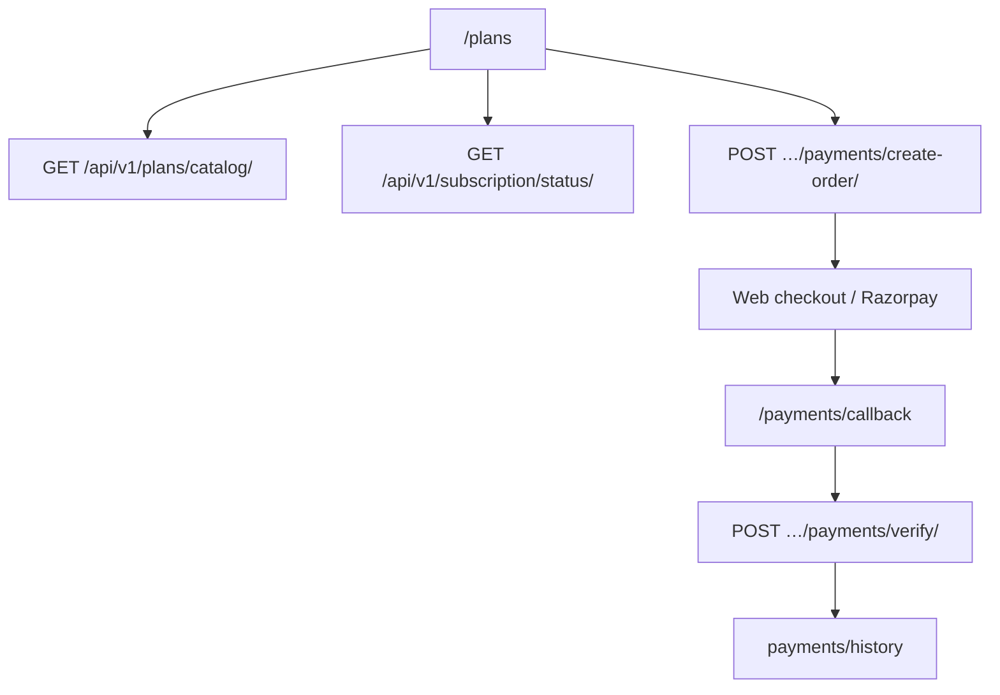

---

## 12. Notifications and push

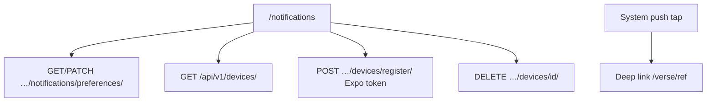

---

## 13. Community and support

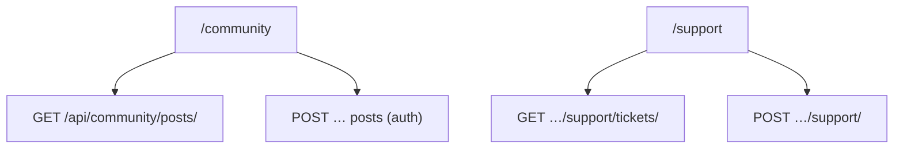

---

## 14. Quote art

Stack screen **`/quote-art`** (opened from Profile). Uses **`GitaBrowseAPIPermission`**: browser-style access without a token is allowed; **token + Free plan** may receive **403** on quote-art JSON routes — typically **Plus/Pro** for in-app token calls.

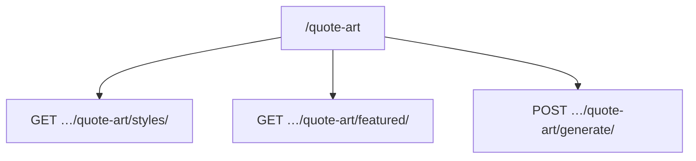

---

## 15. Saved reflection detail

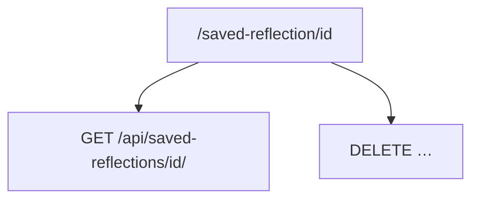

---

## 16. Typical journey (qualitative)

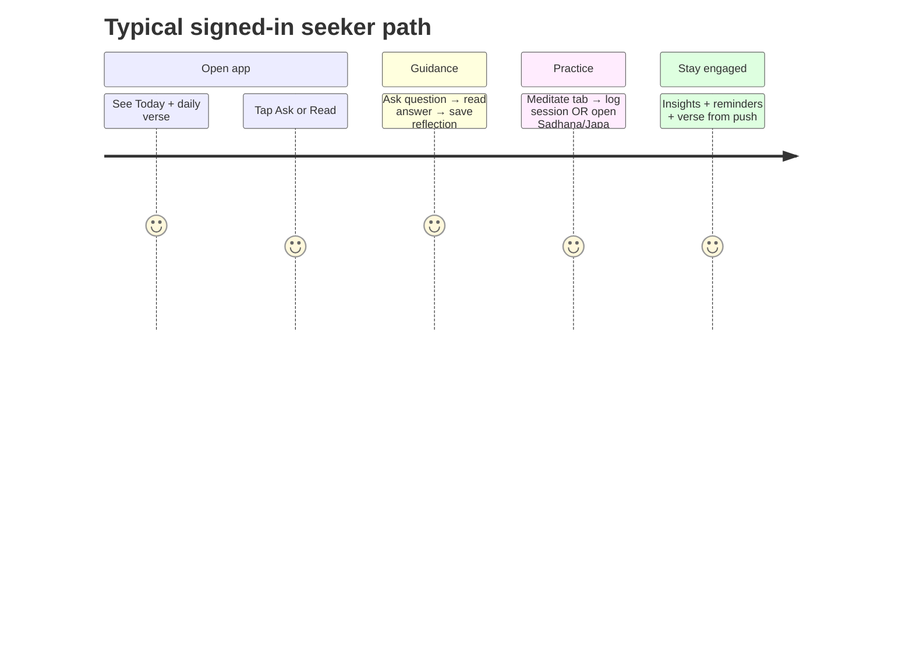

---

## Design notes

- **Primary loop:** **Today** → **Ask** or **Read** → **Verse** → optional save / log practice.
- **Secondary loop:** **Meditate** / **Sadhana** / **Japa** → **Insights** and reminders.
- **Account:** **Profile** (`/profile`) → **Plans**, **payments history**, **notifications**, **account**, **quote art**, **support**, **saved reflections**, shortcuts back to **History** tab.

---

## Possible follow-ups (product / doc)

- Rename or clarify Today’s Heart card if users confuse **chat history** with **saved reflections**.
- **`POST …/sadhana/.../complete/`** exists on the API for day completion; confirm whether mobile should call it after playback.
- Align client paths on **`/api/v1/`** consistently (today some screens use `/api/...` without `v1`; behavior is the same).

---

*Last aligned with Expo tab layout and routes: 2026-04-27 (revised for Today → history vs profile, Meditate entry points, quote art / saved reflection / payments).*
