# Mobile user app flows

**Purpose:** Diagrams for the **Expo app** (`bhagavadgitaguide_mobile-main`): auth, tabs, and how each major feature connects to routes and APIs. Mermaid renders in GitHub, many IDEs, and Notion.

**Code reference:** `expo/app/(tabs)/_layout.tsx` — bottom tabs are **Today**, **Ask**, **Meditate**, **History**, **Insights**; `read` and `profile` use `href: null` (reachable via navigation, not tab bar).

**Backend routes:** `/api/…` and `/api/v1/…` are equivalent (`config/urls.py`).

---

## 1. Entry and authentication

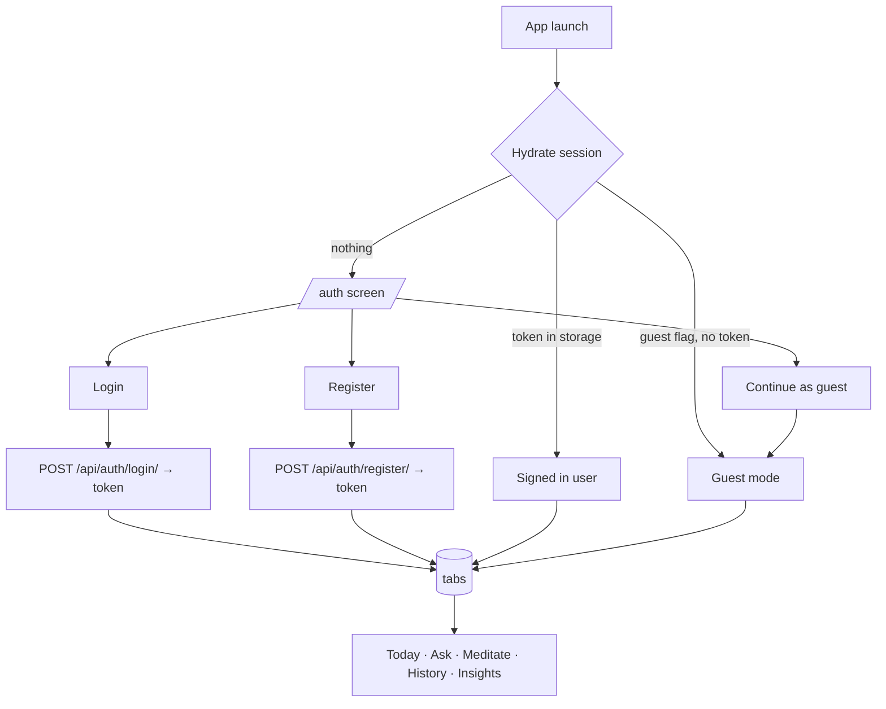

---

## 2. Main shell (tabs + hidden routes)

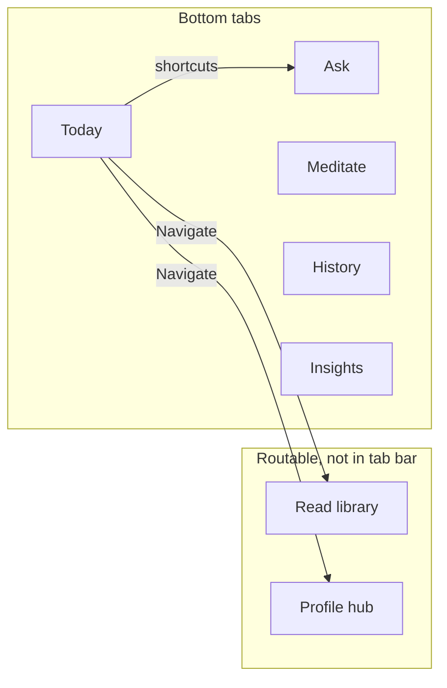

---

## 3. Today tab → downstream features

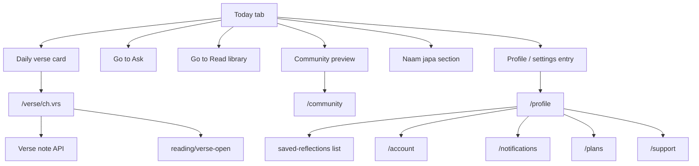

---

## 4. Ask (guidance Q&A)

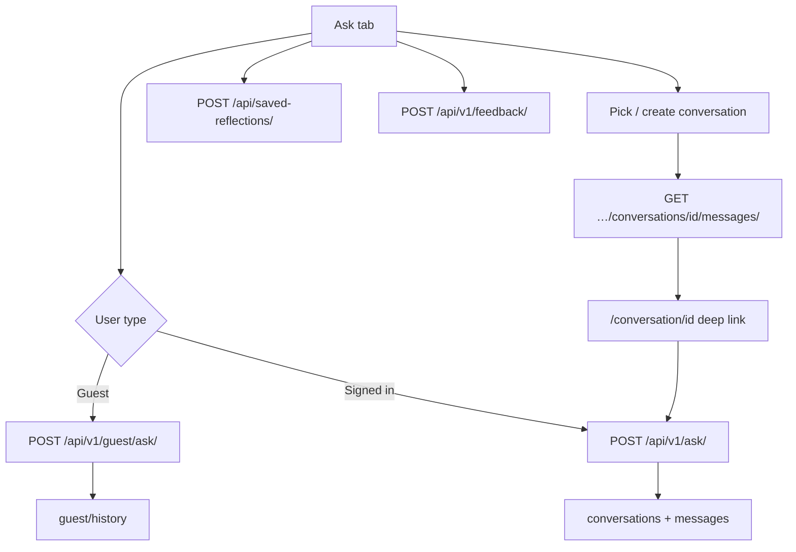

---

## 5. Read (library and search)

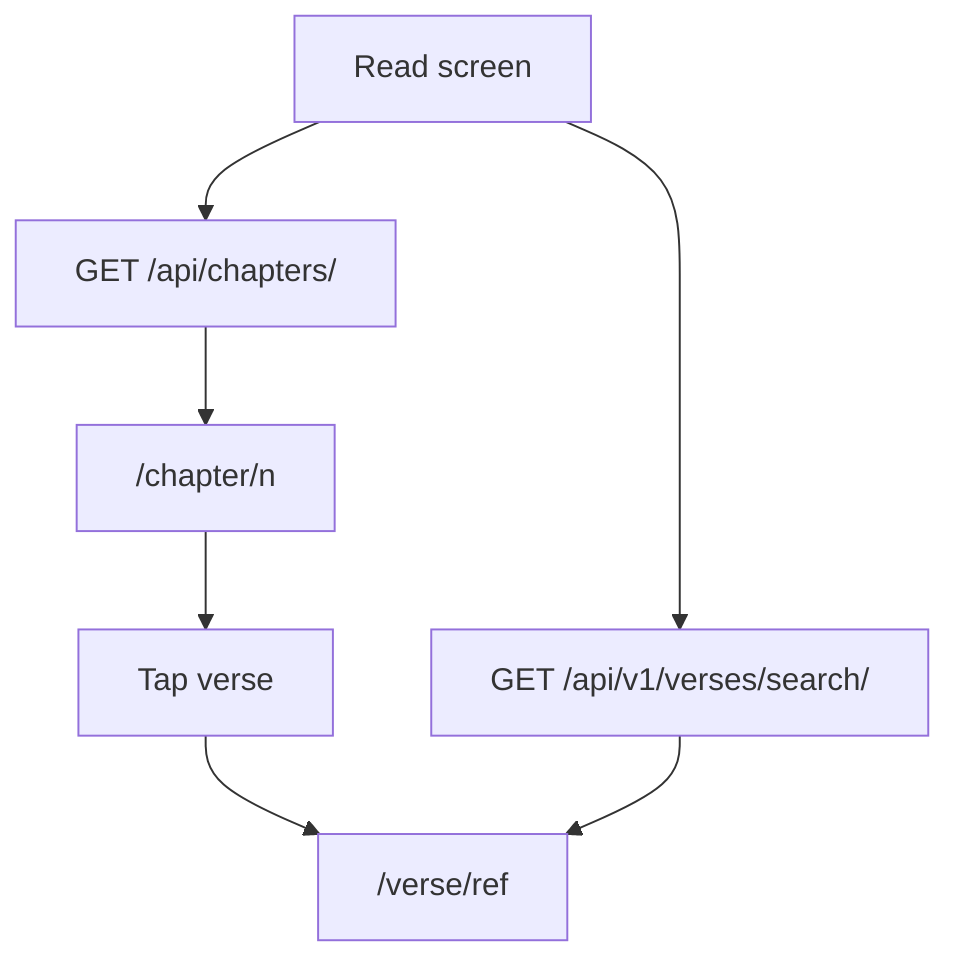

---

## 6. History (threads)

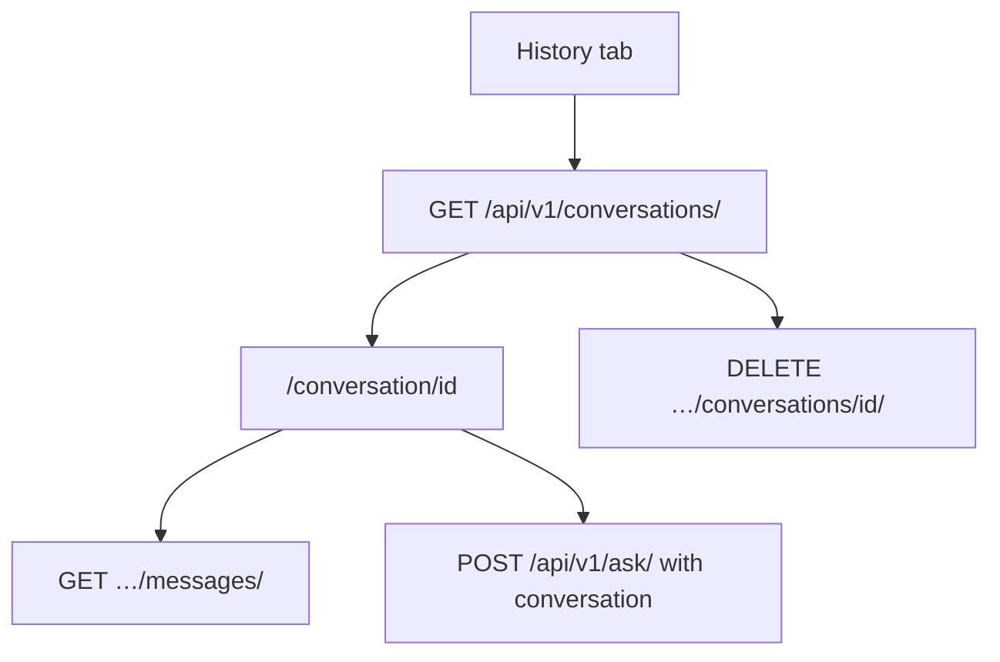

---

## 7. Insights

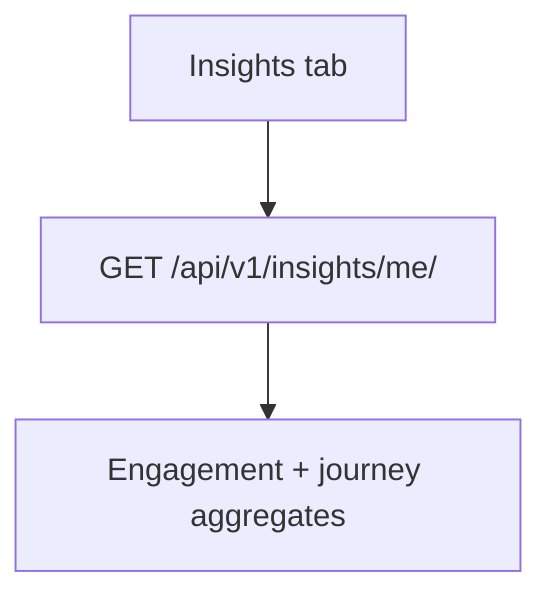

---

## 8. Meditate (workflows and logging)

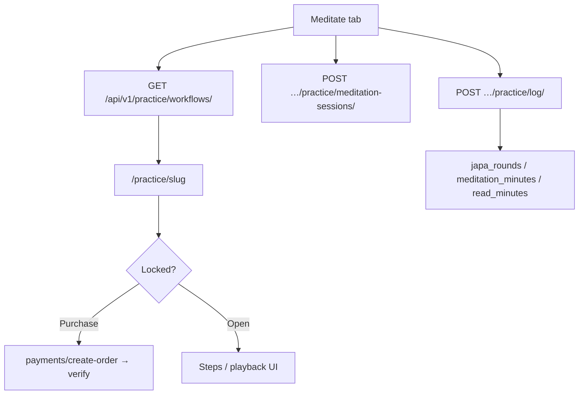

---

## 9. Sadhana (guided programs)

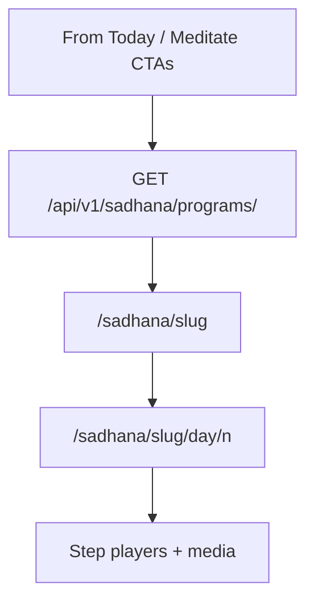

---

## 10. Japa (personal commitments)

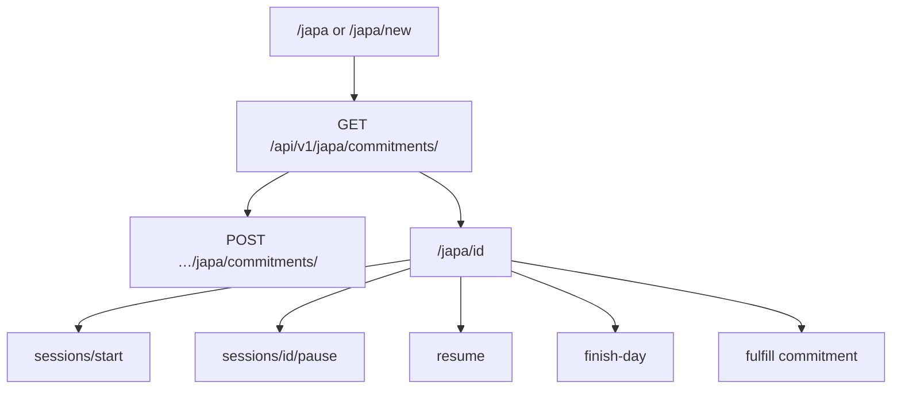

---

## 11. Plans and payments

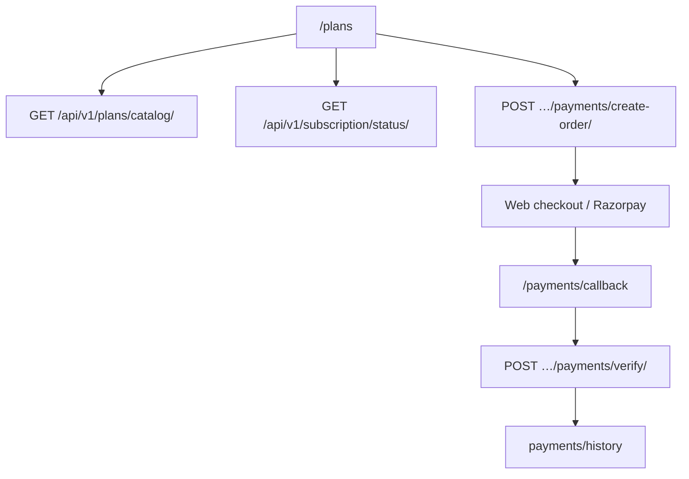

---

## 12. Notifications and push

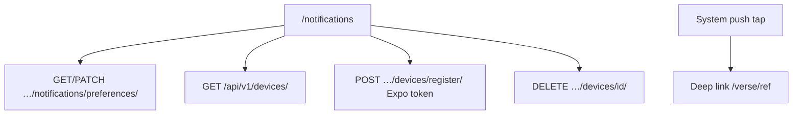

---

## 13. Community and support

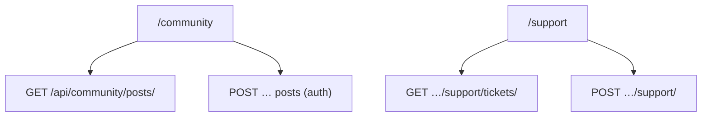

---

## 14. Typical journey (qualitative)

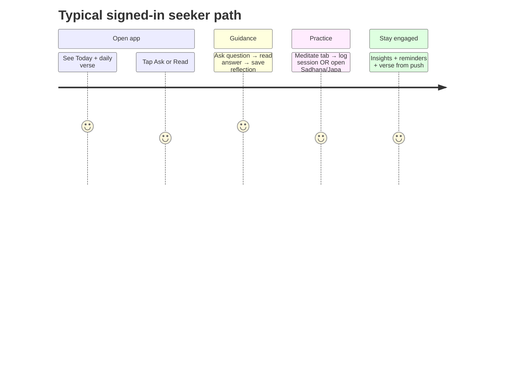

---

## Design notes

- **Primary loop:** **Today** → **Ask** or **Read** → **Verse** → optional save / log practice.
- **Secondary loop:** **Meditate** / **Sadhana** / **Japa** → **Insights** and reminders.
- **Account:** **Profile** (stack) → **Plans**, **notifications**, **account**, **support**.

---

*Last aligned with Expo tab layout and routes: 2026-04-27.*
